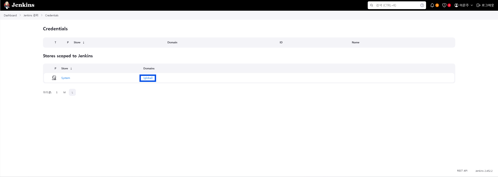
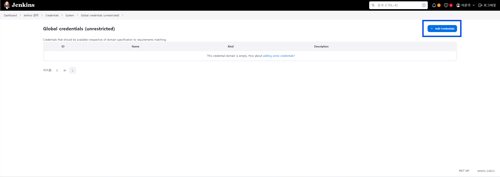
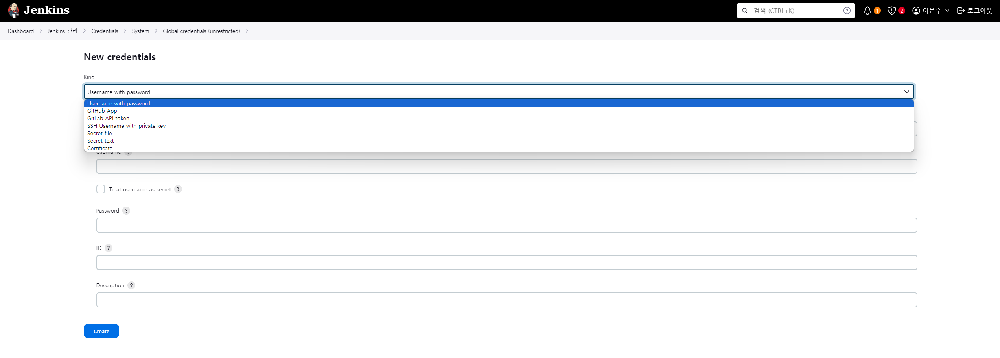

# Jenkins Credentials 설정 방법

#### 1. Jenkins 관리 >> Credentials로 이동 후 global 탭을 클릭합니다.

#### 2. 우측 상단에 Add credentials를 클릭합니다.

#### 3. Kind 탭을 클릭하여 자격 증명의 목적에 맞게 유형을 선택합니다.

 

> **참고**  
> 자세한 내용은 [Jenkins 공식 문서](https://www.jenkins.io/doc/book/using/using-credentials/)를 참조하세요.
